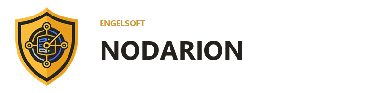

  <picture>
    <source media="(prefers-color-scheme: dark)" srcset="custom_components/nodarion/brand/dark_logo.png">
    <source media="(prefers-color-scheme: light)" srcset="custom_components/nodarion/brand/logo.png">
    
  </picture>

<h1 align="center">Engelsoft Nodarion für Home Assistant</h1>

  
  
  
  
  

> **Ein Netzwerk, ein Gesamtbild:** Nodarion führt aktive Ping-/TCP-Scans,
> FRITZ!Box- und Mesh-Daten sowie die DNS-Aktivitäten aus AdGuard Home pro
> Teilnehmer zusammen. Statt drei voneinander getrennten Datenquellen entsteht
> eine gemeinsame, verständliche Sicht auf Geräte, Verbindungen und
> Auffälligkeiten – inklusive lokaler Regeln und optionaler KI-Analyse.

Diese Kombination aus Netzwerkscanner, Router-Integration und DNS-Auswertung
ist für Home Assistant außergewöhnlich und macht Nodarion zu einer besonders
umfassenden Lösung für die Überwachung des Heimnetzes. Die Integration erkennt
nicht nur, **ob** ein Gerät erreichbar ist, sondern hilft auch zu verstehen,
**wo** es verbunden ist, **wie** es kommuniziert und **ob** sein Verhalten
auffällig erscheint.

Nodarion arbeitet als lokale Home-Assistant-Custom-Integration, scannt ein
einstellbares IPv4-Netz und legt pro gefundenem Teilnehmer einen
Konnektivitäts-Binärsensor an.

## Installation

### HACS

1. In HACS **Integrationen** öffnen.
2. Im Menü **Benutzerdefinierte Repositories** auswählen.
3. `https://github.com/engelsofta/nodarion` als Repository vom Typ
   **Integration** hinzufügen.
4. **Engelsoft Nodarion** installieren und Home Assistant neu starten.

### Manuell

1. Den Ordner `custom_components/nodarion` in den gleichnamigen Ordner der
   Home-Assistant-Konfiguration kopieren.
2. Home Assistant neu starten.
3. Unter **Einstellungen → Geräte & Dienste → Integration hinzufügen** nach
   **Engelsoft Nodarion** suchen.
4. Das lokale Netz als CIDR eintragen, zum Beispiel `192.168.178.0/24`.

## Verhalten

- Eine automatisch registrierte **Engelsoft Nodarion**-Seite in der HA-Seitenleiste
- Gerätebezogene Anwesenheitssteuerung: ausgewählte Teilnehmer werden sofort
  online und erst nach einem einstellbaren Timeout offline gesetzt
- Wichtige Netzwerkteilnehmer direkt im Dashboard markieren
- Optionale Home-Assistant-Meldung, sobald ein überwachtes Gerät offline geht
- Dauerhaftes Live-Log für neue Geräte, Online-/Offline-Wechsel und Namensänderungen
- Persistenter Teilnehmerbestand: bekannte Geräte bleiben auch nach einem
  Home-Assistant-Neustart sichtbar, wenn sie beim ersten Scan offline sind
- Kennzahlen, Suche, Statusfilter, Sortierung und responsive Gerätetabelle
- Klick auf einen Teilnehmer öffnet dessen Home-Assistant-Eigenschaften
- Optionale direkte FRITZ!Box-Erkennung über TR-064 als Ergänzung zu Ping/TCP
- Automatische FRITZ!Box-Internetsperre für neu entdeckte Geräte bis zur
  manuellen Bestätigung in der Teilnehmerliste
- Anzeige des aktuellen Mesh-Zugangspunkts und Protokollierung von Mesh-Wechseln
- Anzeige von LAN-, WLAN- oder Powerline-Verbindung, WLAN-Frequenzband,
  RX-/TX-Datenrate und – sofern von der FRITZ!Box geliefert – Signalstärke
- Anzeige der Adressvergabe (DHCP oder statisch) und der verbleibenden
  DHCP-Lease-Zeit
- Anzeige von FRITZ!Box-Modell und installierter FRITZ!OS-Version
- Optionale AdGuard-Home-Auswertung pro Teilnehmer mit DNS-Anfragen,
  Blockierungsquote, letzter Aktivität, Domains, Treffergründen, DNS-Protokoll
  und einem Hinweis auf eine mögliche DNS-Umgehung
- AdGuard-Home-Verwaltung für Home-Assistant-Administratoren: Domains direkt
  aus dem DNS-Protokoll blockieren oder freigeben, eigene Filterregeln pflegen
  sowie DNS-Rewrites anlegen und löschen
- Eigener Reiter **Überwachung** mit lokalen Regeln für unbekannte Geräte,
  ungewöhnliche Aktivität während einer Ruhezeit, häufige Statuswechsel,
  Identitätsänderungen und länger offline gebliebene wichtige Geräte
- Einstellbare Lernphase, Bestätigungszeit und Grenzwerte direkt in der
  Nodarion-Oberfläche
- Persistente Warnungshistorie mit optionalen Home-Assistant-Benachrichtigungen
- Optionale tägliche KI-Netzwerkanalyse über die bevorzugte
  Home-Assistant-AI-Task-Entität mit Bewertung, Empfehlungen und Tagesvergleich
- Über **Jetzt scannen** kann aus der Oberfläche ein Scan angefordert werden.
- Jeder Teilnehmer erhält ein Gerät und einen `binary_sensor`.
- `on` bedeutet erreichbar, `off` bedeutet nach der einstellbaren Anzahl
  fehlgeschlagener Scans nicht mehr erreichbar.
- IP, MAC-Adresse, Hostname, Verbindungsdetails, Adressvergabe und Anzahl
  verpasster Scans stehen als Attribute bereit.
- Vollständig lokaler MAC-Herstellerabgleich mit über 58.000 Präfixen. Der
  Hersteller erscheint direkt unter der MAC-Adresse; Präfix, Zuteilungstyp und
  Registerstand werden beim Darüberfahren angezeigt.
- Randomisierte beziehungsweise lokal verwaltete MAC-Adressen werden aus
  Datenschutz- und Genauigkeitsgründen nicht einem Hersteller zugeordnet.
- Jede IP-Adresse ist ein fester überwachter Platz mit einer dauerhaft gleichen
  Entity-ID, zum Beispiel `binary_sensor.192_168_178_42`.
- Wechselt das Gerät hinter einer IP-Adresse, bleiben Gerät und Entity-ID
  erhalten; MAC-Adresse, Hostname und automatisch verwalteter Name werden
  aktualisiert.
- Der automatisch verwaltete HA-Gerätename wird bei einer Änderung des
  Hostnamens aktualisiert. Ein vom Benutzer gesetzter HA-Name bleibt erhalten.
- Die IP-Adresse dient als stabile Identität des überwachten Platzes.

## Hinweise

Der Home-Assistant-Host muss das Zielnetz direkt erreichen können. Bei einer
Container-Installation kann `network_mode: host` nötig sein. Ohne aktivierte
FRITZ!Box-Anbindung können Geräte, die weder auf Ping noch auf einen der
konfigurierten TCP-Ports reagieren, technisch nicht entdeckt werden. Bei
aktivierter FRITZ!Box-Anbindung gilt ein dort als aktiv gemeldeter Teilnehmer
auch ohne Ping-Antwort als online. Veraltete Einträge aus der Nachbartabelle
allein werden weiterhin nicht als Online-Nachweis verwendet. Auch eine
abgelehnte TCP-Verbindung zählt nicht; erforderlich ist ein erfolgreicher
TCP-Verbindungsaufbau.

Für die direkte FRITZ!Box-Erkennung muss in der FRITZ!Box der Zugriff für
Anwendungen über TR-064 erlaubt sein. Empfohlen wird ein eigener
FRITZ!Box-Benutzer für Nodarion. Die Zugangsdaten können über die Optionen der
Integration hinterlegt werden.

Beim ersten Start der Internetschutzfunktion gelten alle bereits gespeicherten
Teilnehmer als bestätigt. Erst danach neu entdeckte Geräte werden über den
TR-064-Dienst `X_AVM-DE_HostFilter` für den Internetzugang gesperrt. Die lokale
Kommunikation im Heimnetz bleibt möglich. Die Freigabe erfolgt ausdrücklich in
der Spalte „Internetzugang“. Ändert sich die MAC-Adresse an einem bekannten
IP-Platz, ist eine erneute Bestätigung erforderlich.

Zur Reduzierung der Netz- und Systemlast läuft nur die aktive Ping/TCP-Erkennung
im eingestellten Scanintervall. FRITZ!Box- und Mesh-Daten werden höchstens jede
Minute, AdGuard-Daten höchstens alle zehn Minuten und FRITZ!Box-Geräteinformationen
höchstens einmal pro Stunde neu abgefragt. Dazwischen nutzt Nodarion die zuletzt
erfolgreich gelesenen Zusatzdaten.

Für die optionale AdGuard-Home-Auswertung werden die direkt erreichbare
Adresse der AdGuard-Home-Weboberfläche sowie ein Administrationsbenutzer
benötigt. Das Query-Log muss aktiviert sein. Nodarion liest höchstens 10.000
Einträge, speichert daraus nur eine begrenzte In-Memory-Auswertung und lädt
nach dem ersten Abruf nur neue Einträge nach. Geräte, die VPN, Private DNS
oder einen externen DNS-Server verwenden, können in AdGuard Home fehlen.

Schreibende AdGuard-Funktionen sind ausschließlich für
Home-Assistant-Administratoren sichtbar und serverseitig geschützt. Vor dem
Löschen von Regeln oder Rewrites verlangt das Panel eine Bestätigung. Domains,
Regeln und Rewrite-Ziele werden vor der Übergabe an AdGuard Home validiert.

Die KI-Auswertung ist standardmäßig deaktiviert. Bei anonymisiertem
DNS-Datenschutz werden nur Zähler und stabile, nicht rückrechenbare
Domain-Kennungen an die konfigurierte KI übergeben. Vollständige Domainnamen
werden nur nach ausdrücklicher Auswahl übertragen. Bei einer Cloud-KI verlassen
die zusammengefassten Netzwerkdaten das lokale System.

## Lizenz

Engelsoft Nodarion wird unter der [MIT-Lizenz](LICENSE) veröffentlicht.
